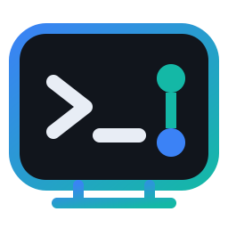
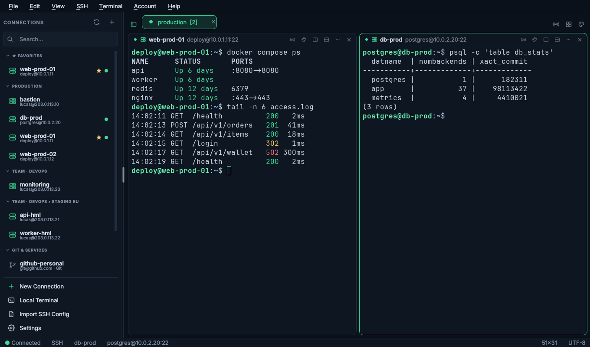
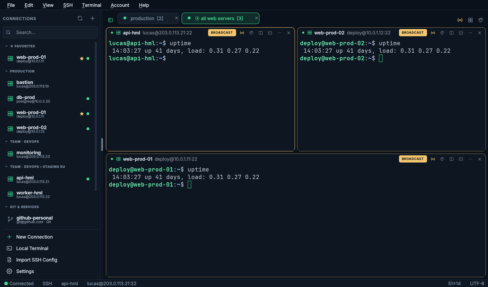
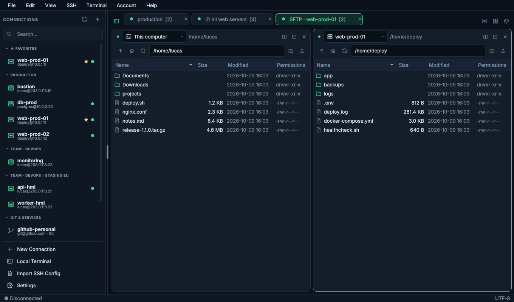
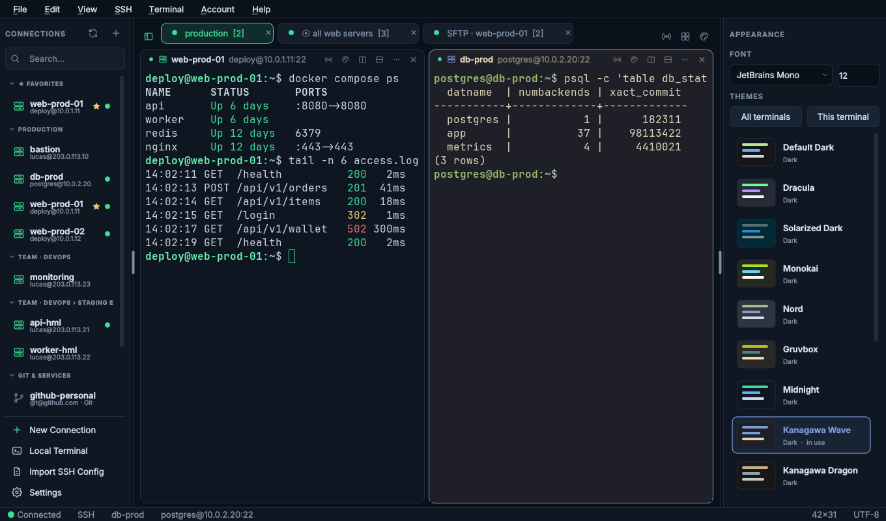
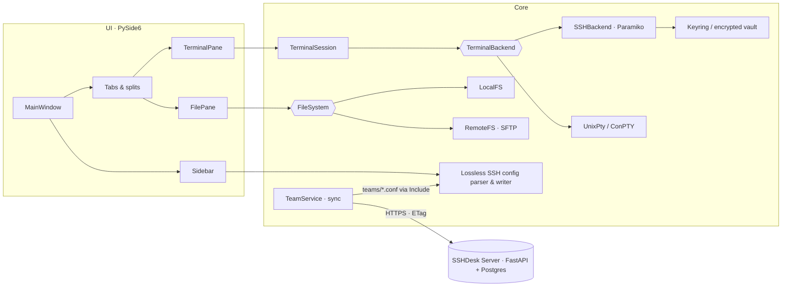

<div align="center">



# SSHDesk

**A free, open-source SSH client for Windows and Linux that treats your `~/.ssh/config` as the source of truth.**

Tabs and splits, broadcast input, an SFTP file manager with drag and drop, and optional team sharing on your own server.

[](https://github.com/LucasCA-Git/sshdesk/actions/workflows/build.yml)
[](https://github.com/LucasCA-Git/sshdesk/releases)
[](LICENSE)


-41cd52.svg)

[Features](#features) · [Download](#download) · [Quick start](#quick-start) · [Teams](#team-sharing-self-hosted) · [Architecture](#architecture) · [Docs](docs/COMO_FUNCIONA.md) · [Changelog](CHANGELOG.md) · [🇧🇷 Português](README.pt-BR.md)



</div>

---

## Why SSHDesk?

- **Your config, not ours.** SSHDesk reads and edits your existing `~/.ssh/config` with a lossless parser. Comments, `Include`, `Match` and unknown options survive every edit, and `ssh`, `scp` and `git` keep working exactly as before. Nothing to import, no lock-in.
- **Modern workflow, zero cost.** You get split views with different hosts, broadcast typing, a two-pane SFTP browser, themes and saved passwords: the comfort of commercial SSH clients, MIT-licensed.
- **Teams without a vendor cloud.** Companies run their own small server (Docker) to share hosts and groups with invites. Keys and passwords never leave each person's machine.

## Features

### Terminals

| | |
|---|---|
| **Split with any host** | Put two *different* servers side by side or below: another SSH host, a local shell or the same connection. Splits nest, and `Ctrl+Shift+G` arranges a grid. |
| **Broadcast input** | `Ctrl+Shift+I` sends what you type to every terminal of the tab. Broadcasting panes get a yellow border and a badge, so you always know. |
| **Real terminal emulation** | xterm with 256/true color, alternate screen (vim, htop, less), mouse reporting, bracketed paste, UTF-8/CJK, IME and ABNT2 dead keys. Rendering uses a QPainter cell grid. |
| **Local shells** | bash/zsh/fish with a real PTY on Linux; PowerShell 7, Windows PowerShell, cmd and WSL via ConPTY on Windows. |
| **Tabs that behave** | Status dots (🟢🟡🔴), reopen closed tabs, reconnect in place, optional auto-reconnect with back-off. |

<p align="center"></p>

### Files (SFTP)

- Two-pane file manager: **this computer | server**. Each panel has its own host selector, and file panels live in the same splits as terminals.
- **Drag and drop** files and folders from Explorer or your file manager to upload. Drag between panels to download or to copy host → host. Drop onto a folder to move.
- Recursive transfers with progress and cancel, *Replace / Skip* on conflicts, new folder, rename (F2), delete (Del), hidden files.
- Uses the same authentication, saved passwords and ProxyJump as the terminals. Every transfer opens its own SFTP channel on the existing connection, so there is no second login.

<p align="center"></p>

### Connections & security

- One click connects: host, user, port and key come from your SSH config. `ssh -G` resolves the effective config when OpenSSH is installed, with a built-in resolver as fallback.
- Authentication by key (including passphrase-protected keys and certificates), agent (ssh-agent, Pageant, Windows OpenSSH agent), keyboard-interactive/2FA, and password.
- **Save password** once, stop retyping. Secrets go to the OS keyring (Windows Credential Manager / Secret Service). Where there is none (WSL, servers), they go to an **encrypted local vault**. Nothing is ever stored in plain text.
- Native **ProxyJump** (multi-hop) and ProxyCommand. Local/remote/dynamic (SOCKS) **port forwarding** from the config or on demand.
- `known_hosts` verification with SHA256 fingerprint prompts. A changed host key blocks the connection.
- Git endpoints (github.com, gitlab.com…) are detected and kept apart from servers: double-click tests the key instead of opening a useless shell.

### Managing hosts

- Create, edit, duplicate, rename and delete hosts in a form. Only the changed lines are rewritten, with a backup and an atomic write each time.
- Favorites, recents, visual groups, instant search, and a resizable sidebar with a grip you can always pull back.
- External edits are detected live: *Reload / Keep / View differences*.

### Look & feel

- Calm dark UI with terminal cards and pill tabs. Color schemes include Midnight, Kanagawa, Everforest, Dracula, Nord, Gruvbox, Solarized and Hacker, set for all terminals or per terminal.
- **What's New** window on the first launch after each update: a thank-you note and only what changed since your version.

<p align="center"></p>

## Download

Pre-built executables for **Windows** and **Linux** are published on the [Releases page](https://github.com/LucasCA-Git/sshdesk/releases). Every push also builds them in [GitHub Actions](https://github.com/LucasCA-Git/sshdesk/actions/workflows/build.yml) (see *Artifacts*).

> The Windows build is not code-signed yet. If SmartScreen warns you, choose *More info › Run anyway*.

## Quick start

### From source

Requires **Python 3.12+**.

<details open>
<summary><b>Windows (PowerShell)</b></summary>

```powershell
git clone https://github.com/LucasCA-Git/sshdesk.git
cd sshdesk
py -m venv .venv
.venv\Scripts\Activate.ps1
pip install -r requirements.txt
python app.py
```
</details>

<details>
<summary><b>Linux / WSL (bash, zsh)</b></summary>

```bash
sudo apt install python3-venv python3-full libxcb-cursor0 libxkbcommon0 libegl1
git clone https://github.com/LucasCA-Git/sshdesk.git && cd sshdesk
python3 -m venv ~/.venvs/sshdesk
source ~/.venvs/sshdesk/bin/activate
pip install -r requirements.txt
python app.py
```
</details>

<details>
<summary><b>Linux / WSL (fish)</b></summary>

```fish
python3 -m venv ~/.venvs/sshdesk
source ~/.venvs/sshdesk/bin/activate.fish
pip install -r requirements.txt
python app.py
```
</details>

> **WSL:** the app reads the Linux `~/.ssh/config`, not the Windows one. Keep the venv in your Linux home (not under `/mnt/c`), which is much faster. Dragging files from Windows Explorer into WSLg apps is usually not supported, so run the Windows build for that.

Install as a package to get the `sshdesk` command: `pip install .`

### Command line

```bash
sshdesk                        # open the app
sshdesk web-prod db-prod       # open and connect to two hosts (two tabs)
sshdesk deploy@10.0.0.5:2222   # ad-hoc connection, not in the config
sshdesk --local                # start with a local terminal
sshdesk --list                 # print the hosts and exit
sshdesk -F ~/other/config      # use another config file
sshdesk --debug                # verbose logging
```

### Keyboard shortcuts

| Action | Shortcut |
|---|---|
| New local terminal / close tab or pane / reopen | `Ctrl+T` / `Ctrl+W` / `Ctrl+Shift+T` |
| Split right / down (choose what opens) | `Ctrl+Shift+\` / `Ctrl+Shift+-` |
| Arrange tab as grid | `Ctrl+Shift+G` |
| Broadcast input to the tab | `Ctrl+Shift+I` |
| Show / hide hosts sidebar | `Ctrl+Shift+B` (or drag / double-click the grip) |
| Themes panel | `Ctrl+Shift+A` |
| Copy / paste | `Ctrl+Shift+C` / `Ctrl+Shift+V` |
| Search connections / new connection | `Ctrl+Shift+F` / `Ctrl+Shift+N` |
| Font bigger / smaller / reset | `Ctrl+=` / `Ctrl+-` / `Ctrl+0` |
| Reload SSH config / fullscreen / settings | `F5` / `F11` / `Ctrl+,` |

All shortcuts can be changed in *Settings › Keyboard*. Keys that are not shortcuts go to the terminal (Ctrl+C, Ctrl+D, Ctrl+L…).

## Team sharing (self-hosted)

Optional. Each company runs its **own** SSHDesk Server (FastAPI, in [`server/`](server/)), so its data stays under its control.

```bash
cd server
cp .env.example .env      # set SECRET_KEY, POSTGRES_PASSWORD, optional SMTP
docker compose up -d      # API on :8080. Put it behind HTTPS for real use.
```

In the app, use *Account › Create Account / Sign In* with your server URL. After that:

- **Teams and roles** (owner / admin / member), with **invites by email + one-time code**.
- **Share a host** (right-click › *Share with Team*), choosing the group, or **share a whole group** (right-click the group title).
- Members see `TEAM · DEVOPS › HML` sections, and the hosts also work in plain `ssh`/`scp`/`git`, because they are written to a managed file pulled in with `Include`. Your personal hosts always win on name conflicts.
- **Never shared:** private keys, passwords, `ProxyCommand` or any option that could run commands on members' machines. The allow-list is enforced by the server *and* by the app.

The full deployment guide, configuration, API and security notes are in [server/README.md](server/README.md).

## Architecture



| Decision | Why |
|---|---|
| Own **lossless** SSH config parser | `paramiko.SSHConfig` is read-only and drops comments and order. Edits must touch only the lines that changed. |
| `ssh -G` with a built-in fallback | Resolves exactly like OpenSSH (Match, Include, tokens), and still works when OpenSSH isn't installed. |
| `pyte` + QPainter cell grid | A mature VT/xterm parser plus pixel-exact rendering of cursor, selection, colors and alternate screen. |
| `pty.fork()` on Linux, ConPTY on Windows | Real job control (Ctrl+C/Ctrl+Z) and real Windows consoles from a GUI app. |
| Native ProxyJump (`direct-tcpip`) | No dependency on the `ssh` binary, and the same behavior on both OSes. |
| Worker threads + a relay object | Network never blocks the UI, and late callbacks from closed tabs are dropped safely instead of crashing. |
| Transport-agnostic backends | Adding `docker exec`, `kubectl exec`, serial or telnet means implementing 4 methods. |

A step-by-step explanation of what happens on each action (connect, type, render, save, sync, transfer) is in **[docs/COMO_FUNCIONA.md](docs/COMO_FUNCIONA.md)** (Portuguese).

<details>
<summary><b>Project layout</b></summary>

```
src/ssh_terminal/
├── main.py              CLI + Qt bootstrap
├── models/              SSHHost, AppSettings, ConnectionSpec…
├── ssh/                 config parser/writer, resolver, auth, sessions, ProxyJump, forwarding, host keys
├── terminal/            emulator (pyte), widget (QPainter), session bridge, backends (SSH / PTY / ConPTY)
├── services/            app context, config, settings, credentials (keyring/vault), connections,
│                        file systems + transfers (SFTP), teams sync, changelog
├── ui/                  main window, sidebar, tabs/splits, file pane, dialogs, themes panel
└── resources/           icons, CHANGELOG.md (shown in "What's New")
server/                  optional team server (FastAPI, SQLAlchemy, Argon2, JWT)
tests/                   unit, offscreen GUI, team sync end-to-end, live sshd integration
scripts/                 build scripts, test sshd, screenshot generator
```
</details>

## Security

- Passwords and passphrases are never written in plain text or logged. They live in memory, or, only if you ask, in the OS keyring or the encrypted local vault. *Settings › Security* shows where and can clear everything.
- Private keys stay where they are. They are never copied, shown, uploaded or included in diagnostics, and the log has a redaction filter.
- Unknown hosts require fingerprint confirmation, and `known_hosts` is only appended to, never rewritten.
- No telemetry. The app only talks to the servers you connect to and, if you sign in, your own team server.

Found a vulnerability? Please report it privately; see [SECURITY.md](SECURITY.md).

## Development

```bash
pip install -r requirements-dev.txt
ruff check src tests
python -m pytest                                   # ~160 unit + offscreen GUI tests, no SSH server needed
SSHDESK_LIVE_SSHD=/tmp/sshd python -m pytest tests/integration   # 13 end-to-end tests against real sshd
cd server && python -m pytest                      # team server API tests
QT_QPA_PLATFORM=offscreen python scripts/make_screenshots.py      # regenerate docs/images
pyinstaller --noconfirm --clean sshdesk.spec       # build dist/SSHDesk(.exe)
```

CI (GitHub Actions) runs lint, tests and the PyInstaller build on **Windows and Linux** for every push. Tests use a temporary `HOME`, so your real `~/.ssh/config` is never touched.

Contributions are welcome! Read [CONTRIBUTING.md](CONTRIBUTING.md) to get started.

## Roadmap

- [ ] Installers: Windows setup (Inno Setup), AppImage and `.deb`, published automatically on tag
- [ ] In-app update notification
- [ ] Code signing for Windows builds
- [ ] Drag files from a remote panel straight to Explorer
- [ ] Team presence ("who is online") and SSO (OIDC) for the team server
- [ ] End-to-end encryption of team host data
- [ ] macOS build

Have an idea? [Open a feature request](https://github.com/LucasCA-Git/sshdesk/issues/new?template=feature_request.md).

## Known limitations

- X11 forwarding and `AddKeysToAgent` are written to the config but not applied by the built-in client.
- `Match` blocks are only evaluated when OpenSSH is available (`ssh -G`).
- Mouse reporting supports SGR mode (1006), which vim, htop, tmux and mc use.
- macOS is not officially built or tested yet.

## Acknowledgements

Built with [PySide6 / Qt](https://doc.qt.io/qtforpython-6/), [Paramiko](https://www.paramiko.org/), [pyte](https://github.com/selectel/pyte), [cryptography](https://cryptography.io/), [keyring](https://github.com/jaraco/keyring), [pywinpty](https://github.com/andfoy/pywinpty) and, on the server, [FastAPI](https://fastapi.tiangolo.com/), [SQLAlchemy](https://www.sqlalchemy.org/) and [argon2-cffi](https://argon2-cffi.readthedocs.io/). The UX is inspired by modern SSH clients such as Termius; the implementation and visual identity are original.

## License

[MIT](LICENSE) © 2026 Lucas Cardoso Alecrim and SSHDesk contributors.

<div align="center">

**If SSHDesk saves you time, please ⭐ the repository. It really helps.**

Made by [Lucas Cardoso Alecrim](https://github.com/LucasCA-Git)

</div>
