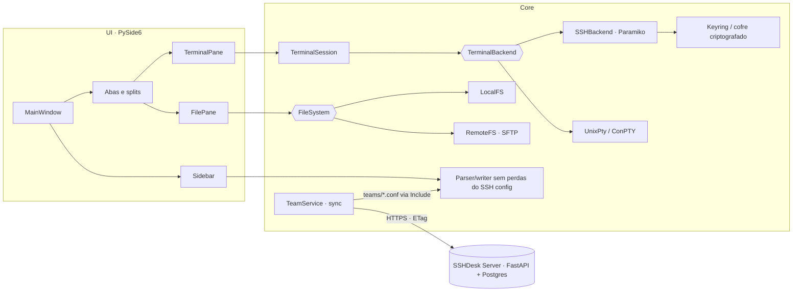

<div align="center">


# SSHDesk

**Cliente SSH gratuito e open source para Windows, macOS e Linux que usa o seu `~/.ssh/config` como fonte da verdade.**

Abas e splits, digitação em vários terminais, gerenciador de arquivos SFTP com arrastar e soltar e compartilhamento em equipe no seu próprio servidor.

[](https://github.com/LucasCA-Git/sshdesk/actions/workflows/build.yml)
[](https://github.com/LucasCA-Git/sshdesk/releases)
[](LICENSE)


[Recursos](#recursos) · [Download](#download) · [Começando](#começando) · [Times](#compartilhamento-em-equipe-self-hosted) · [Arquitetura](#arquitetura) · [Guia completo](docs/COMO_FUNCIONA.md) · [Changelog](CHANGELOG.md) · [🇺🇸 English](README.md)


</div>

---

## Por que o SSHDesk?

- **O config é seu, não nosso.** O SSHDesk lê e edita o `~/.ssh/config` que você já tem, com um parser sem perdas. Comentários, `Include`, `Match` e opções desconhecidas sobrevivem a qualquer edição, e `ssh`, `scp` e `git` continuam funcionando igual. Não há importação nem dependência do app.
- **Fluxo moderno, custo zero.** Splits com hosts diferentes, digitação em vários terminais, SFTP em dois painéis, temas e senha salva: o conforto dos clientes SSH comerciais, com licença MIT.
- **Times sem nuvem de terceiros.** Cada empresa sobe o próprio servidor (Docker) para compartilhar hosts e grupos com convites. Chaves e senhas nunca saem da máquina de cada pessoa.

## Recursos

### Terminais

| | |
|---|---|
| **Split com qualquer host** | Dois servidores *diferentes* lado a lado ou um embaixo do outro: outro host SSH, um shell local ou a mesma conexão. Splits podem ser aninhados, e `Ctrl+Shift+G` organiza em grade. |
| **Broadcast input** | `Ctrl+Shift+I`: o que você digita vai para todos os terminais da aba. A borda amarela e o selo deixam claro quando está ligado. |
| **Emulação de terminal de verdade** | xterm com 256 cores e true color, tela alternativa (vim, htop, less), mouse, bracketed paste, UTF-8/CJK, IME e teclas mortas ABNT2. O desenho é uma grade de células com QPainter. |
| **Shells locais** | bash/zsh/fish com PTY real no Linux; PowerShell 7, Windows PowerShell, cmd e WSL via ConPTY no Windows. |
| **Abas confiáveis** | Status 🟢🟡🔴, reabrir aba fechada, reconectar no mesmo lugar, auto-reconnect com espera crescente. |

<p align="center"></p>

### Arquivos (SFTP)

- Gerenciador de arquivos em dois painéis: **este computador | servidor**. Cada painel tem seu seletor de host, e os painéis de arquivos ficam nos mesmos splits dos terminais.
- **Arraste e solte** arquivos e pastas do Explorer ou do gerenciador de arquivos para enviar. Arraste entre painéis para baixar ou copiar de host para host. Solte em cima de uma pasta para mover.
- Transferência de pastas inteiras com progresso e cancelar, *Replace / Skip* quando o nome já existe, nova pasta, renomear (F2), apagar (Del) e arquivos ocultos.
- Usa a mesma autenticação, senha salva e ProxyJump dos terminais. Cada transferência abre o próprio canal SFTP na conexão existente, então não há segundo login.

<p align="center"></p>

### Conexões e segurança

- Um clique conecta: host, usuário, porta e chave vêm do SSH config. O `ssh -G` resolve a configuração efetiva quando o OpenSSH existe, e um resolvedor próprio cobre a falta dele.
- Autenticação por chave (inclusive com passphrase e certificados), agente (ssh-agent, Pageant, agente do OpenSSH no Windows), keyboard-interactive/2FA e senha.
- **Salvar senha** uma vez e não digitar mais. Vai para o cofre do sistema (Windows Credential Manager / Secret Service). Onde não existe cofre (WSL, servidor), vai para um **cofre local criptografado**. Nunca fica em texto puro.
- **ProxyJump** nativo (vários saltos) e ProxyCommand. **Port forwarding** local, remoto e dinâmico (SOCKS), pelo config ou na hora.
- Verificação de `known_hosts` com fingerprint SHA256. Se a host key mudar, a conexão é bloqueada.
- Endpoints Git (github.com, gitlab.com…) são reconhecidos e ficam separados dos servidores: o duplo clique testa a chave em vez de abrir um shell inútil.

### Gerenciando hosts

- Criar, editar, duplicar, renomear e excluir hosts por formulário. Só as linhas alteradas são reescritas, sempre com backup e escrita atômica.
- Favoritos, recentes, grupos visuais com subgrupos (Produção › Web › EU), busca instantânea e uma barra lateral redimensionável com alça que sempre dá para puxar de volta.
- Mudanças feitas por fora no arquivo são detectadas na hora: *Reload / Keep / View differences*.

### Visual

- Interface escura e calma, com cartões de terminal e abas em pílula. Esquemas de cor: Midnight, Kanagawa, Everforest, Dracula, Nord, Gruvbox, Solarized, Hacker…, para todos os terminais ou só para um.
- Janela **What's New** na primeira abertura depois de cada atualização: agradecimento e só o que mudou desde a sua versão.

<p align="center"></p>

## Download

Os apps prontos ficam na [página de Releases](https://github.com/LucasCA-Git/sshdesk/releases) e também são gerados a cada push no [GitHub Actions](https://github.com/LucasCA-Git/sshdesk/actions/workflows/build.yml) (em *Artifacts*):

| Sistema | Arquivo | Como instalar |
|---|---|---|
| Windows 10/11 | `SSHDesk.exe` | é só executar |
| macOS 12+ · Apple Silicon (M1–M4) | `SSHDesk-<versão>-macos-arm64.dmg` | abra o `.dmg` e arraste o **SSHDesk** para *Aplicativos* |
| macOS 12+ · Intel | `SSHDesk-<versão>-macos-x86_64.dmg` | igual |
| Linux (x86_64) | `SSHDesk` | `chmod +x SSHDesk && ./SSHDesk` |

> Os builds ainda não são assinados.
> **Windows:** se o SmartScreen avisar, clique em *Mais informações › Executar assim mesmo*.
> **macOS:** na primeira vez, clique com o botão direito no **SSHDesk** em *Aplicativos* › **Abrir** › **Abrir** (ou rode `xattr -dr com.apple.quarantine /Applications/SSHDesk.app`). Depois disso abre normalmente.

## Começando

### Pelo código-fonte

Requer **Python 3.12+**.

<details open>
<summary><b>Windows (PowerShell)</b></summary>

```powershell
git clone https://github.com/LucasCA-Git/sshdesk.git
cd sshdesk
py -m venv .venv
.venv\Scripts\Activate.ps1
pip install -r requirements.txt
python app.py
```

Se o PowerShell bloquear o `Activate.ps1`, rode uma vez: `Set-ExecutionPolicy -Scope CurrentUser RemoteSigned`.
</details>

<details>
<summary><b>Linux / WSL (bash, zsh)</b></summary>

```bash
sudo apt install python3-venv python3-full libxcb-cursor0 libxkbcommon0 libegl1
git clone https://github.com/LucasCA-Git/sshdesk.git && cd sshdesk
python3 -m venv ~/.venvs/sshdesk
source ~/.venvs/sshdesk/bin/activate
pip install -r requirements.txt
python app.py
```
</details>

<details>
<summary><b>Linux / WSL (fish)</b></summary>

```fish
python3 -m venv ~/.venvs/sshdesk
source ~/.venvs/sshdesk/bin/activate.fish
pip install -r requirements.txt
python app.py
```
</details>

> **WSL:** o app lê o `~/.ssh/config` do **Linux**, não o do Windows. Crie o venv no home do Linux, não em `/mnt/c`, que é muito mais lento. Arrastar arquivos do Explorer do Windows para apps do WSLg normalmente não funciona; para isso, use a versão Windows.

Para instalar como pacote e ter o comando `sshdesk`: `pip install .`

### Linha de comando

```bash
sshdesk                        # abre o app
sshdesk web-prod db-prod       # abre e conecta em dois hosts (duas abas)
sshdesk deploy@10.0.0.5:2222   # conexão avulsa (fora do config)
sshdesk --local                # abre com um terminal local
sshdesk --list                 # lista os hosts e sai
sshdesk -F ~/outro/config      # usa outro arquivo de config
sshdesk --debug                # log detalhado
```

### Atalhos

| Ação | Atalho |
|---|---|
| Novo terminal local / fechar aba ou painel / reabrir | `Ctrl+T` / `Ctrl+W` / `Ctrl+Shift+T` |
| Split à direita / abaixo (escolhe o que abrir) | `Ctrl+Shift+\` / `Ctrl+Shift+-` |
| Organizar a aba em grade | `Ctrl+Shift+G` |
| Broadcast input na aba | `Ctrl+Shift+I` |
| Mostrar / esconder hosts | `Ctrl+Shift+B` (ou arraste / dois cliques na alça) |
| Painel de temas | `Ctrl+Shift+A` |
| Copiar / colar | `Ctrl+Shift+C` / `Ctrl+Shift+V` (macOS: `⌘C` / `⌘V`) |
| Buscar conexões / nova conexão | `Ctrl+Shift+F` / `Ctrl+Shift+N` |
| Fonte maior / menor / padrão | `Ctrl+=` / `Ctrl+-` / `Ctrl+0` |
| Recarregar SSH config / tela cheia / settings | `F5` / `F11` / `Ctrl+,` |

Todos os atalhos podem ser trocados em *Settings › Keyboard*. Teclas que não são atalho vão para o terminal (Ctrl+C, Ctrl+D, Ctrl+L…).
**macOS:** os atalhos do app usam **⌘** no lugar do Ctrl (⌘T, ⌘W…), e a tecla **Control** vai para o terminal normalmente (Control+C interrompe, Control+R busca no histórico). ⌘C, ⌘V, ⌘A e ⌘K copiam, colam, selecionam tudo e limpam o terminal.
**Dica:** `Ctrl+W` também é "apagar palavra" no bash; se você usa muito, troque "Close tab" para `Ctrl+Shift+W`.

## Compartilhamento em equipe (self-hosted)

Opcional. Cada empresa sobe o **próprio** SSHDesk Server (FastAPI, em [`server/`](server/)), então os dados ficam sob controle dela.

```bash
cd server
cp .env.example .env      # SECRET_KEY, POSTGRES_PASSWORD, SMTP opcional
docker compose up -d      # API na porta 8080. Em produção, coloque atrás de HTTPS.
```

No app, use *Account › Create Account / Sign In* com a URL do seu servidor. A partir daí:

- **Times e papéis** (owner / admin / member), com **convite por email + código de uso único**.
- **Compartilhar um host** (botão direito › *Share with Team*), escolhendo o grupo, ou **um grupo inteiro** com seus subgrupos (botão direito no título do grupo).
- **Cada um usa o próprio login.** Seu usuário e o caminho da sua chave não são compartilhados: no primeiro acesso cada membro informa o dele (usuário, chave, senha opcional), que fica só na máquina dele. Marque *Share my login too* apenas para conta de serviço, como `deploy`.
- Qualquer pessoa pode **tirar um host do time só da própria lista** (continua no time para os outros e dá para restaurar); admins podem remover para todos.
- Os membros veem seções `TEAM · DEVOPS › HML`, e os hosts funcionam também no `ssh`/`scp`/`git` comum, porque são escritos num arquivo gerenciado incluído com `Include`. Em caso de nome repetido, o host pessoal sempre vence.
- **Nunca compartilhado:** chaves privadas, senhas, `ProxyCommand` ou qualquer opção que execute comandos na máquina dos membros. O servidor **e** o app aplicam a allow-list.

Guia de implantação, configuração, API e segurança: [server/README.md](server/README.md).

## Arquitetura



| Decisão | Por quê |
|---|---|
| Parser **sem perdas** próprio | O `paramiko.SSHConfig` é só leitura e perde comentários e ordem. Uma edição deve mexer só nas linhas que mudaram. |
| `ssh -G` com fallback | Resolve exatamente como o OpenSSH (Match, Include, tokens) e continua funcionando sem OpenSSH. |
| `pyte` + grade com QPainter | Parser VT/xterm maduro e desenho fiel de cursor, seleção, cores e tela alternativa. |
| `pty.fork()` no Linux, ConPTY no Windows | Controle de jobs de verdade (Ctrl+C/Ctrl+Z) e console real no Windows a partir de um app gráfico. |
| ProxyJump nativo (`direct-tcpip`) | Não depende do binário `ssh` e funciona igual nos dois sistemas. |
| Threads + objeto relay | A rede nunca trava a interface, e avisos atrasados de abas fechadas são descartados com segurança em vez de derrubar o app. |
| Backends independentes do transporte | `docker exec`, `kubectl exec`, serial ou telnet = implementar 4 métodos. |

O passo a passo do que acontece em cada ação (conectar, digitar, desenhar, salvar, sincronizar, transferir) está em **[docs/COMO_FUNCIONA.md](docs/COMO_FUNCIONA.md)**.

<details>
<summary><b>Estrutura do projeto</b></summary>

```
src/ssh_terminal/
├── main.py              CLI + inicialização do Qt
├── models/              SSHHost, AppSettings, ConnectionSpec…
├── ssh/                 parser/writer do config, resolvedor, autenticação, sessões, ProxyJump, forwarding, host keys
├── terminal/            emulador (pyte), widget (QPainter), ponte de sessão, backends (SSH / PTY / ConPTY)
├── services/            contexto do app, config, settings, credenciais (keyring/cofre), conexões,
│                        sistemas de arquivos + transferências (SFTP), sync de times, changelog
├── ui/                  janela principal, sidebar, abas/splits, painel de arquivos, diálogos, painel de temas
└── resources/           ícones, CHANGELOG.md (mostrado no "What's New")
server/                  servidor de times opcional (FastAPI, SQLAlchemy, Argon2, JWT)
tests/                   unitários, interface offscreen, sync de times ponta a ponta, integração com sshd real
scripts/                 scripts de build, sshd de teste, gerador de screenshots
```
</details>

## Onde ficam as coisas

| O quê | Linux / WSL | Windows |
|---|---|---|
| SSH config (fonte da verdade) | `~/.ssh/config` | `%USERPROFILE%\.ssh\config` |
| Settings do app | `~/.config/sshdesk/app_config.json` | `%APPDATA%\SSHDesk\app_config.json` |
| Backups do config | `~/.config/sshdesk/backups/` | `%APPDATA%\SSHDesk\backups\` |
| Log | `~/.config/sshdesk/logs/app.log` | `%APPDATA%\SSHDesk\logs\app.log` |
| Senhas salvas | Secret Service ou `credentials.vault` (criptografado) | Credential Manager ou `credentials.vault` |
| Hosts do time | `~/.config/sshdesk/teams/*.conf` | `%APPDATA%\SSHDesk\teams\*.conf` |

O `app_config.json` guarda **só metadados de interface** (tema, fonte, favoritos, recentes, grupos, atalhos). Nada de host, usuário, porta ou chave.

### Exemplo de SSH config suportado

```sshconfig
# Jump box
Host bastion
    HostName bastion.example.com
    User lucas

Host server-prod prod
    HostName 10.0.0.10
    User lucas
    IdentityFile ~/.ssh/id_ed25519

Host database
    HostName 10.0.0.20
    User postgres
    ProxyJump bastion
    LocalForward 5432 localhost:5432

Host *
    ServerAliveInterval 60
```

- `server-prod prod`: o primeiro nome é o alias exibido; os outros funcionam na busca.
- `Host *` e padrões aparecem em **SSH Defaults**, nunca como servidor.
- O comentário logo acima de um `Host` vira tooltip e sai junto se você excluir o host.
- Opções que o formulário não conhece aparecem em *Advanced › Other options* e são preservadas.

## Segurança

- Senhas e passphrases nunca são gravadas em texto puro nem logadas. Ficam na memória ou, só se você pedir, no cofre do sistema ou no cofre local criptografado. *Settings › Security* mostra onde e apaga tudo.
- Chaves privadas ficam onde estão. Nunca são copiadas, exibidas, enviadas ou incluídas em diagnósticos, e o log tem filtro de redação.
- Hosts desconhecidos pedem confirmação do fingerprint, e o `known_hosts` só recebe acréscimos (nunca é reescrito).
- Sem telemetria. O app só fala com os servidores em que você conecta e, se você entrar numa conta, com o servidor de times da sua empresa.

Encontrou uma vulnerabilidade? Reporte em particular, como explica o [SECURITY.md](SECURITY.md).

## Desenvolvimento

```bash
pip install -r requirements-dev.txt
ruff check src tests
python -m pytest                                   # ~160 testes unitários + interface offscreen, sem servidor SSH
SSHDESK_LIVE_SSHD=/tmp/sshd python -m pytest tests/integration   # 13 testes ponta a ponta com sshd real
cd server && python -m pytest                      # testes da API do servidor de times
QT_QPA_PLATFORM=offscreen python scripts/make_screenshots.py      # regenera docs/images
pyinstaller --noconfirm --clean sshdesk.spec       # gera dist/SSHDesk(.exe)
```

O CI (GitHub Actions) roda lint, testes e o build PyInstaller em **Windows e Linux** a cada push. Os testes usam um `HOME` temporário, então o seu `~/.ssh/config` real nunca é tocado.

**Lançar uma versão:** suba `__version__` (e o `pyproject.toml`), escreva as notas em inglês no topo de `src/ssh_terminal/resources/CHANGELOG.md` e copie para o `CHANGELOG.md` da raiz. Os testes avisam se algo ficar fora de sincronia. Cada pessoa vê a janela **What's New** na primeira vez que abrir a nova versão. Detalhes em [CONTRIBUTING.md](CONTRIBUTING.md).

## Problemas comuns

| Sintoma | O que fazer |
|---|---|
| "Host key … has CHANGED" | O servidor foi reinstalado ou o IP mudou. Se confiar, rode o `ssh-keygen -R` mostrado nos detalhes. |
| "Authentication failed" | Clique em *Details*: mostra os métodos tentados e os aceitos. Confira `User`, `authorized_keys` e *Help › Diagnostics*. |
| Senha/passphrase pedida toda vez | Marque "Save password (don't ask again)" ou use o agente (`ssh-add`). |
| `Could not load the Qt platform plugin "xcb"` | `sudo apt install libxcb-cursor0 libxkbcommon0 libegl1`; no WSL, `wsl --update`. |
| `externally-managed-environment` | Use um venv (`python3 -m venv ~/.venvs/sshdesk`). |
| No WSL os hosts não aparecem | O WSL lê o config do Linux. Copie o do Windows ou rode o app no Windows. |
| Terminal local não abre no Windows | `pip install pywinpty` (Windows 10 1809+). |
| Quero ver o que aconteceu | Rode com `--debug` e abra *Help › Open Log Folder*. |

## Roadmap

- [ ] Instaladores: setup para Windows (Inno Setup), AppImage e `.deb`, publicados automaticamente por tag
- [ ] Aviso de nova versão dentro do app
- [ ] Assinatura de código no Windows
- [ ] Arrastar do painel remoto direto para o Explorer
- [ ] "Quem está online" nos times e SSO (OIDC) no servidor
- [ ] Criptografia ponta a ponta dos hosts do time
- [ ] Builds de macOS assinados e notarizados (Apple Developer ID)

## Limitações conhecidas

- X11 forwarding e `AddKeysToAgent` são gravados no config, mas o cliente embutido não os aplica.
- Blocos `Match` só são avaliados quando o OpenSSH está disponível (`ssh -G`).
- Mouse apenas no modo SGR (1006), o usado por vim, htop, tmux e mc.
- Os builds de macOS são novos: o CI gera para Apple Silicon e Intel, mas ainda sem assinatura/notarização. Reporte qualquer problema específico do Mac.

## Contribuindo

Contribuições são muito bem-vindas: bugs, ideias, código, documentação e traduções. Veja o [CONTRIBUTING.md](CONTRIBUTING.md) e o [Código de Conduta](CODE_OF_CONDUCT.md).

## Licença

[MIT](LICENSE) © 2026 Lucas Cardoso Alecrim e contribuidores do SSHDesk.

<div align="center">

**Se o SSHDesk te ajuda, deixe uma ⭐ no repositório. Faz diferença!**

Feito por [Lucas Cardoso Alecrim](https://github.com/LucasCA-Git)

</div>
